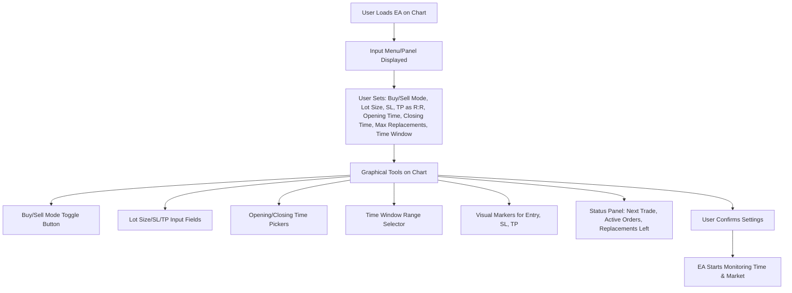
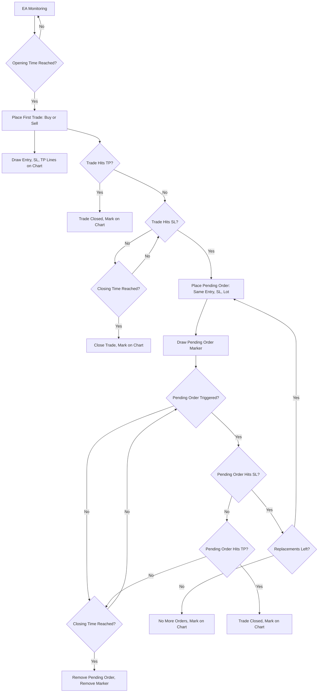
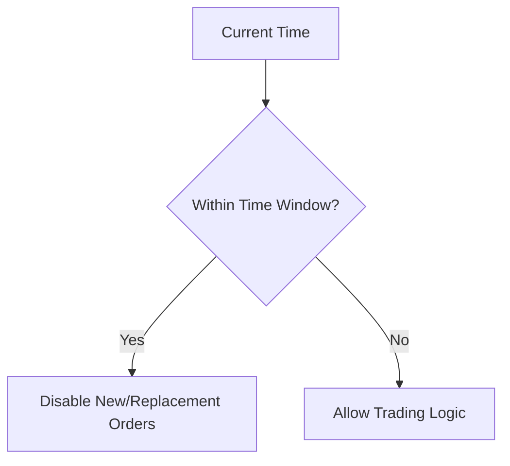
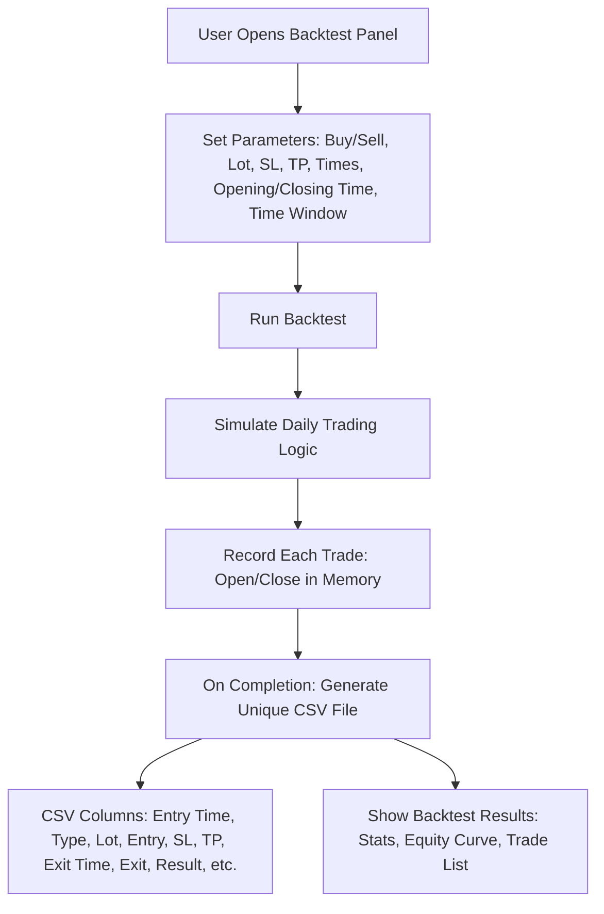
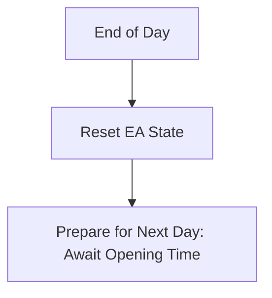

---

## 6. Graphical Features: State Management and Shadowing

This section details how graphical features (buttons, input fields, panels) are enabled, disabled, or shadowed based on the EA's state and trading situation, according to the strategy logic.

### State Variables
- `isTradeActive`: True if a trade is currently open.
- `isPendingOrderActive`: True if a pending order is active.
- `isInTimeWindow`: True if the current time is within the no-trade time window.
- `replacementsLeft`: Number of allowed pending order replacements remaining.
- `isEAEnabled`: True if the EA is running and monitoring the market.

### Graphical Features and Their States

| Feature                        | Enabled When                                      | Disabled/Shadowed When                                 |
|--------------------------------|---------------------------------------------------|--------------------------------------------------------|
| Start/Activate EA Button       | No trade is active, not in time window            | Trade active, in time window, or EA already running    |
| Buy/Sell Mode Toggle           | No trade or pending order active                  | Trade or pending order active                          |
| Lot Size/SL/TP Input Fields    | No trade or pending order active                  | Trade or pending order active                          |
| Opening/Closing Time Pickers   | No trade or pending order active                  | Trade or pending order active                          |
| Time Window Selector           | No trade or pending order active                  | Trade or pending order active                          |
| Replace Order Button           | Trade hit SL, replacementsLeft > 0, not in window | No replacements left, in time window                   |
| Status Panel                   | Always enabled                                   | Always enabled                                         |
| Visual Markers (Entry/SL/TP)   | Trade or pending order active                     | No trade or pending order active                       |
| Shadow Overlay/Message         | In time window, or during trade/pending order     | Not in time window, no trade/pending order             |

### Example State Transitions
- When a trade is opened, all input fields and mode toggles are disabled (shadowed) until the trade is closed or the daily cycle ends.
- If the EA enters the time window, all trading actions are disabled and a shadow overlay/message is shown.
- When a pending order is placed, input fields remain disabled until the order is triggered or removed.
- If the maximum number of replacements is reached, the Replace Order button is disabled.
- The status panel always displays the current state (active trade, pending order, replacements left, time window status, etc.).

---

### Graphical Features and Their State During a Trade

During an active trade (from entry until closure or stop loss):
- **All input fields (lot size, SL, TP, times, mode) are disabled** to prevent changes that could disrupt the strategy.
- **Buy/Sell mode toggle is disabled** to lock the chosen direction.
- **Replace Order button is enabled only if the trade hits SL and replacements are available.**
- **Visual markers (entry, SL, TP lines) are shown on the chart** to indicate the trade’s parameters.
- **Status panel is updated in real time** to show trade status, PnL, and remaining replacements.
- **If the time window is entered during a trade, a shadow overlay/message is displayed** and no new trades or replacements are allowed until the window ends.

This ensures the user interface always reflects the current strategy state, prevents invalid actions, and guides the user through the allowed workflow.
# One Trade EA - Comprehensive Event & UI Flow Charts

This document provides detailed charts covering all aspects of the client requirements, including live trading setup (with graphical/chart tools), backtest setup, and the full event logic for the One Trade EA.

---

## 1. Live Trading Setup (with Graphical Tools)

---

## 2. Daily Trading & Order Management Logic

---

## 3. Time Window Logic

---

## 4. Backtest Setup & Output

---

## 5. Recap: Daily Reset

---

*These charts now cover all required aspects: live trading setup (with graphical/chart tools), full event logic, time window, backtest setup, and output details, as well as daily reset behavior.*
