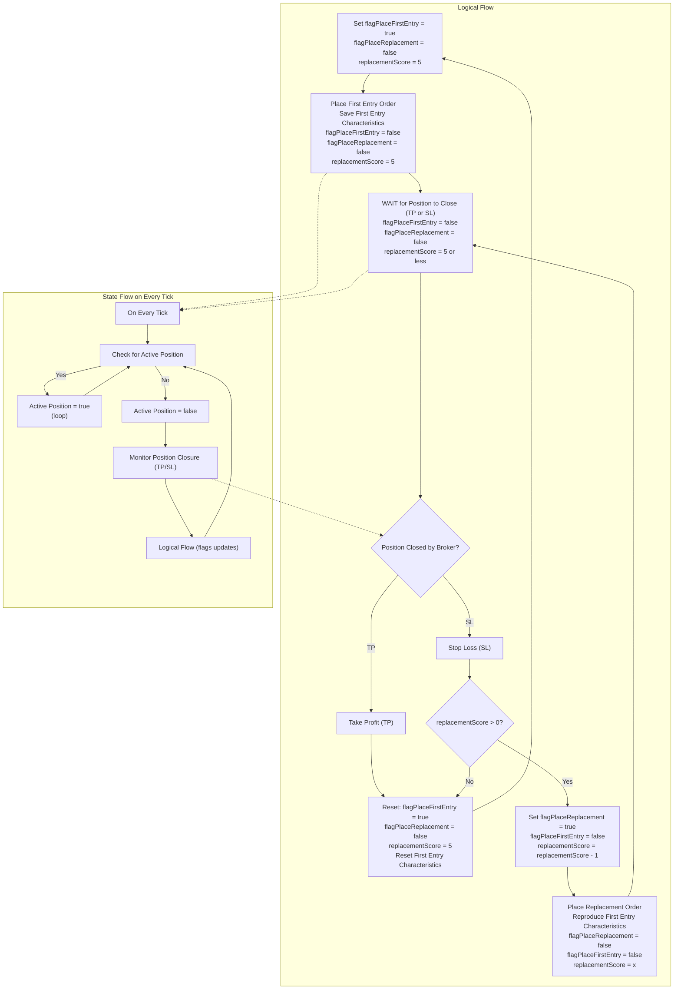
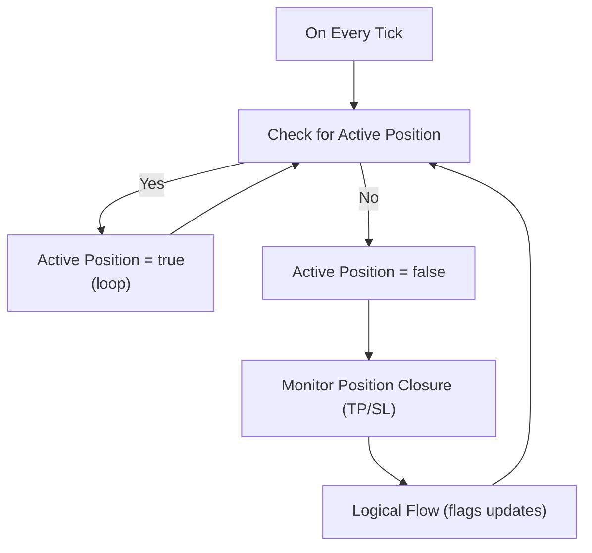
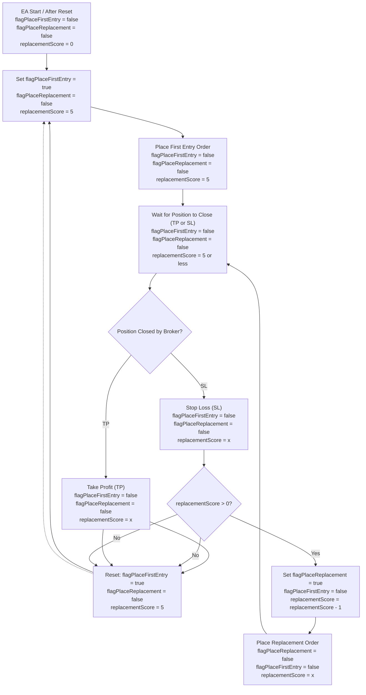

## Combined Logical and State Flow

The following Mermaid diagram combines the logical flow and the state flow, showing how the state flow operates within the logical flow's "Wait for Position to Close" state:

## State Flow on Every Tick

The following Mermaid diagram illustrates the infinite loop process and state checks performed by the EA on every tick:

## Important Implementation Note

After any order action (placing the first entry or a replacement order), all other order-related flags (such as `flagPlaceFirstEntry`, `flagPlaceReplacement`, `flagReset`) must be explicitly set to `false`. This ensures that only one action is triggered per cycle and prevents accidental double actions or repeated order placements.

# One Trade EA – Order Circulation Flags Technical Document (Refactored)

## Overview
This document describes the improved logic and usage of order circulation flags ("trafic flags") in the One Trade EA. The system ensures a continuous, controlled trading loop, with a replacement score mechanism and clear flag-driven order management.

## Circulation Flags
- **flagPlaceFirstEntry**: Command to place the initial order (active at EA start or after a reset).
- **flagPlaceReplacement**: Command to place a replacement order after a Stop Loss (SL) event, if the replacement score is above zero.
- **flagReset**: Command to reset the EA state (replacement score and flags) after a Take Profit (TP) or when the replacement score reaches zero.

## Replacement Score
- **replacementScore**: Integer, initialized to 5 at EA start and after each reset.
- Decremented by 1 after each replacement trade (after SL).
- When replacementScore reaches 0, the EA resets.

## Logical Flow (Mermaid Diagram)

## Usage Notes
- Only one flag is active at a time.
- After each action (order placement or reset), update the flags accordingly.
- The EA always checks the current flag and acts accordingly on each tick.
- The replacement score ensures a finite number of replacement trades before a reset.

## Example Event Flow
1. **EA Start or After Reset:**
    - Set `flagPlaceFirstEntry = true`, `replacementScore = 5`.
2. **First Entry Order:**
    - Place order, set `flagPlaceFirstEntry = false`.
3. **Position Closed by Broker:**
    - If TP: Reset (go to step 1).
    - If SL:
        - If `replacementScore == 0`: Reset (go to step 1).
        - If `replacementScore > 0`: Set `flagPlaceReplacement = true`, decrement `replacementScore`.
4. **Replacement Order:**
    - Place order, set `flagPlaceReplacement = false`.
    - Wait for position to close, repeat step 3.

---
This schema ensures a robust, continuous, and controlled trading loop, with clear flag-driven order management and a finite replacement mechanism.
