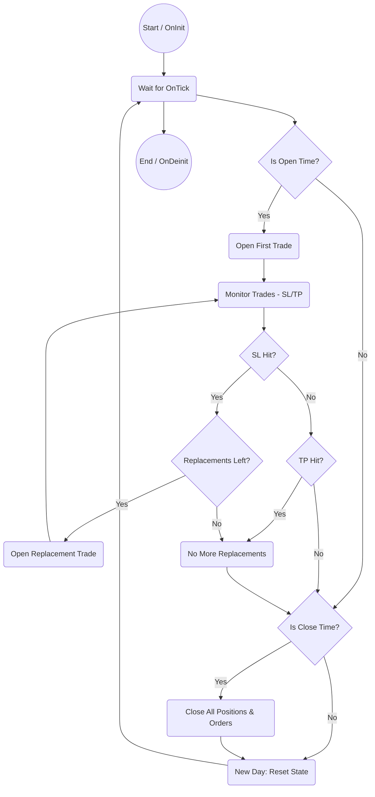

# One Trade EA Project (UpWork Contract)

## Project Overview

This repository contains the development of the "One Trade EA" (Expert Advisor) for MetaTrader platforms, originally contracted via UpWork. The EA implements a time-based, single-trade strategy with robust flag-driven logic and comprehensive CSV logging for backtesting and analysis.

### EA Functionalities

- **Trade Mode:** Select Buy or Sell for the day.
- **Lot Size:** Configurable per trade.
- **Stop Loss (SL):** Set maximum dollar risk per trade.
- **Take Profit (TP):** Risk:Reward ratio, optional.
- **Opening/Closing Time:** Precise control over trade entry and exit.
- **Max Replacements:** Retry logic after SL, with pending orders at the same entry.
- **Time Window:** Disable replacements during specified periods.
- **CSV Logging:** All trades and events are logged for analysis.

For a detailed technical flow, see the [OrderFlags_TechnicalDoc.md](./OrderFlags_TechnicalDoc.md).

---

## MT5 Backtesting Challenge

During development, a critical limitation was discovered in MetaTrader 5 (MT5) backtesting: the platform does not reliably trigger trade events (`OnTradeTransaction`) in the Strategy Tester, making it impossible to detect whether a position was closed by SL or TP in real time. This led to an untrusted solution for professional backtest execution.

Despite providing technical proofs and a price-based workaround ([see details](./MT5_Backtest_SLTP_Limitation_and_Workaround.md)), the client was dissatisfied and closed the contract. As a result, the EA was redeveloped for MetaTrader 4 (MT4), where event-driven logic is reliable.

---

## Outcome & Future Work

While the contract was closed unsuccessfully, this repository stands as a technical reference and proof of the challenges faced. The project demonstrates advanced EA design, robust state management, and transparent documentation.

**We are open for new projects and collaborations.**  
If you are a future contractor or client, feel free to reach out for EA development, trading automation, or technical consulting.

---

## Files

- `OneTradeFlagEA.mq4`: MQL4 EA implementing the full flag-driven logic.
- `OrderFlags_TechnicalDoc.md`: Technical flow diagrams and logic documentation.
- `MT5_Backtest_SLTP_Limitation_and_Workaround.md`: Details on MT5 backtesting limitations.
- `SimpleOneTradeEA_CodeFlow.md`: Code flow for the simplified EA.
- `README.md`: Project summary and context.

---

**Contact:**  
Open for new contracts and technical partnerships.
- **CSV file location:** By default, the CSV file is created in the MetaTrader 5 `Files` directory.

### UI & Feedback

*All graphical and UI code has been removed. The EA is now technical-only.*

## Files

- `OneTradeEA.mq5`: Main EA logic (technical-only). Place this file in your MetaTrader 5 `Experts` folder.
- `OneTradeEA_Core.mqh`: Core trading logic and CSV logging. Place this file in your MetaTrader 5 `Include` folder.

## How to Use

1. Place all files in your MetaTrader 5 `Experts` and `Include` directories as described above.
2. Attach the EA to a chart.
3. Configure all input parameters as desired (see above for format).
4. Run the EA for automated trading and backtesting.
5. Review CSV logs for trade history and results.

## Main Files Breakdown

- `OneTradeEA.mq5`: Main EA script. Handles EA lifecycle (`OnInit`, `OnTick`, `OnDeinit`) and calls core logic methods.
- `OneTradeEA_Core.mqh`: Implements the core trading logic in the `COneTradeEA_Core` class. Manages trade parameters, time windows, CSV logging, trade execution, monitoring, replacements, and closing.

## Technical Workflow Diagram

## Client Requirements Coverage

### Client Requirements Coverage

- Buy/Sell mode selection
- Lot size and stop loss (dollar risk)
- Take profit as risk:reward (optional)
- Strictly time-based entry (no indicators or price action)
- Replacements after stop loss, with max count
- Time window disables replacements
- Daily reset and new trade each day
- All trades and events logged to unique CSV file

## Contact

For further customization or support, contact the project maintainer.