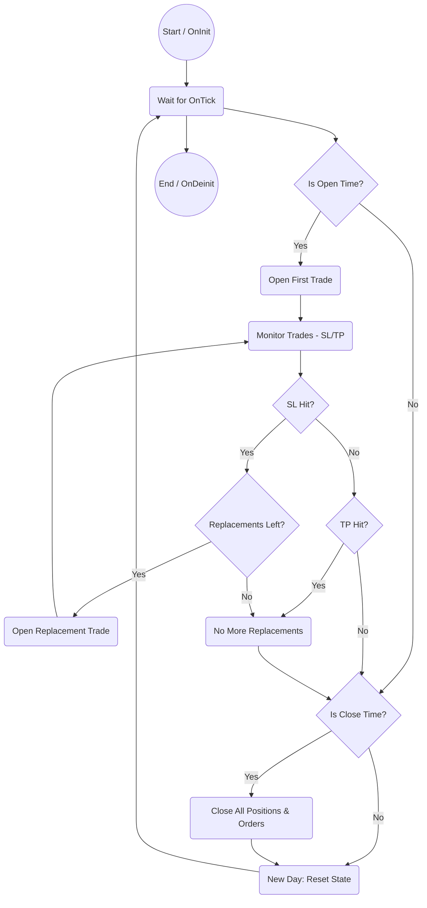

# One Trade EA for MetaTrader 5

## Technical Overview

This Expert Advisor (EA) implements the technical requirements for the "One Trade EA" strategy on MetaTrader 5. It provides robust, automated trading logic and comprehensive CSV logging for backtesting and analysis. All graphical and UI code has been removed; only technical trading and CSV output remain.

## Features & Achievements

### Input Parameters

- Trade Mode: Buy or Sell
- Lot Size
- Stop Loss (pips)
- Risk:Reward ratio (for Take Profit)
- Opening Time (HH:MM:SS)
- Closing Time (HH:MM:SS)
- Max Replacements (number of SL replacements)
- Time Window Start (HH:MM:SS, optional)
- Time Window End (HH:MM:SS, optional)

### Technical Trading Logic

- Opens the first trade at the configured Opening Time.
- If a trade hits Stop Loss, a replacement trade is placed (up to Max Replacements).
- Trades are closed at Take Profit or Closing Time.
- Pending orders are removed at Closing Time.
- Time Window disables replacements during the specified period.
- EA resets daily for new trading cycles.

### CSV Logging

- All trades (opened/closed) are logged to a CSV file: Date, Time, Symbol, TradeType, Lot, SL, TP, Result, Replacement, ErrorCode, Ticket.
- Each backtest/run produces a unique CSV file (symbol, date, random number).
- **CSV file location:** By default, the CSV file is created in the MetaTrader 5 `Files` directory.

### UI & Feedback

*All graphical and UI code has been removed. The EA is now technical-only.*

## Files

- `OneTradeEA.mq5`: Main EA logic (technical-only). Place this file in your MetaTrader 5 `Experts` folder.
- `OneTradeEA_Core.mqh`: Core trading logic and CSV logging. Place this file in your MetaTrader 5 `Include` folder.

## How to Use

1. Place all files in your MetaTrader 5 `Experts` and `Include` directories as described above.
2. Attach the EA to a chart.
3. Configure all input parameters as desired (see above for format).
4. Run the EA for automated trading and backtesting.
5. Review CSV logs for trade history and results.

## Main Files Breakdown

- `OneTradeEA.mq5`: Main EA script. Handles EA lifecycle (`OnInit`, `OnTick`, `OnDeinit`) and calls core logic methods.
- `OneTradeEA_Core.mqh`: Implements the core trading logic in the `COneTradeEA_Core` class. Manages trade parameters, time windows, CSV logging, trade execution, monitoring, replacements, and closing.

## Technical Workflow Diagram

## Client Requirements Coverage

All technical requirements from the client specification are fully implemented:

- Automated trading logic (open, close, SL/TP, replacements)
- Configurable input parameters
- Time window logic
- Daily reset
- Robust CSV output for all trades

## Contact

For further customization or support, contact the project maintainer.