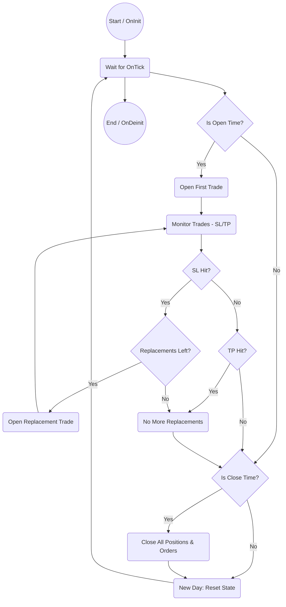

# One Trade EA for MetaTrader 5

## Technical Overview

This Expert Advisor (EA) implements the technical requirements for the "One Trade EA" strategy on MetaTrader 5. It provides robust, automated trading logic and comprehensive CSV logging for backtesting and analysis. All graphical and UI code has been removed; only technical trading and CSV output remain.

## Features & Achievements

### Input Parameters

- Trade Mode: Choose Buy or Sell mode for the day
- Lot Size: Set your desired lot size for each trade
- Stop Loss (in dollars): Set the maximum dollar risk per trade (not pips)
- Take Profit (Risk:Reward ratio): Set your desired risk:reward (e.g., 2 for 1:2). Leave empty or 0 for no take profit
- Opening Time (HH:MM:SS): The exact time the first trade will be opened each day
- Closing Time (HH:MM:SS): The time all trades and pending orders will be closed
- Max Replacements: Number of times to retry after a stop loss (pending order is placed at same entry)
- Time Window Start (HH:MM:SS, optional): Start of period when replacements are disabled
- Time Window End (HH:MM:SS, optional): End of period when replacements are disabled

### Technical Trading Logic

- At the exact Opening Time, the EA places a Buy or Sell trade (as selected in the input menu), with the lot size, stop loss, and take profit you set.
- No other technical or price-based entry conditions are used—entry is strictly time-based.
- If a trade hits Stop Loss, a pending order is placed at the same entry price (up to Max Replacements).
- Trades are closed at Take Profit (if set) or at the Closing Time.
- At Closing Time, all trades and pending orders are closed/removed.
- Time Window disables replacements during the specified period.
- The EA resets daily for a new trading cycle.

### CSV Logging

- All trades (opened/closed) are logged to a CSV file: Date, Time, Symbol, TradeType, Lot, SL, TP, Result, Replacement, ErrorCode, Ticket.
- Each backtest/run produces a unique CSV file (symbol, date, random number).
- **CSV file location:** By default, the CSV file is created in the MetaTrader 5 `Files` directory.

### UI & Feedback

*All graphical and UI code has been removed. The EA is now technical-only.*

## Files

- `OneTradeEA.mq5`: Main EA logic (technical-only). Place this file in your MetaTrader 5 `Experts` folder.
- `OneTradeEA_Core.mqh`: Core trading logic and CSV logging. Place this file in your MetaTrader 5 `Include` folder.

## How to Use

1. Place all files in your MetaTrader 5 `Experts` and `Include` directories as described above.
2. Attach the EA to a chart.
3. Configure all input parameters as desired (see above for format).
4. Run the EA for automated trading and backtesting.
5. Review CSV logs for trade history and results.

## Main Files Breakdown

- `OneTradeEA.mq5`: Main EA script. Handles EA lifecycle (`OnInit`, `OnTick`, `OnDeinit`) and calls core logic methods.
- `OneTradeEA_Core.mqh`: Implements the core trading logic in the `COneTradeEA_Core` class. Manages trade parameters, time windows, CSV logging, trade execution, monitoring, replacements, and closing.

## Technical Workflow Diagram

## Client Requirements Coverage

### Client Requirements Coverage

- Buy/Sell mode selection
- Lot size and stop loss (dollar risk)
- Take profit as risk:reward (optional)
- Strictly time-based entry (no indicators or price action)
- Replacements after stop loss, with max count
- Time window disables replacements
- Daily reset and new trade each day
- All trades and events logged to unique CSV file

## Contact

For further customization or support, contact the project maintainer.