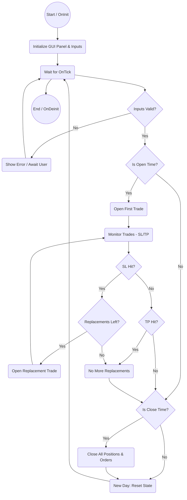

# One Trade EA for MetaTrader 5

## Overview

This Expert Advisor (EA) implements the full requirements specified by the client for the "One Trade EA" strategy. It is designed for MetaTrader 5 and supports robust, configurable, and automated trading logic.

## Features & Achievements

### Input Menu

- Select Buy or Sell mode
- Set Lot Size and Stop Loss
- Set Take Profit using Risk:Reward ratio (leave empty for no TP)
- Set Opening Time (HH:MM or HH:MM:SS)
- Set Closing Time
- Set Max Replacements (number of times to re-place pending orders after SL)
- Set Time Window (period during which replacements are disabled)

### Trading Logic

- **First Trade:** Automatically opens a trade at the specified Opening Time with all configured parameters.
- **Replacing Trade:** If a trade hits Stop Loss, a pending order is immediately placed with the same parameters. This repeats up to the configured max replacements.
- **Closing of Trade:** Trades are closed either at Take Profit or at the specified Closing Time. All pending orders are removed at Closing Time.
- **Time Window:** No replacements are placed during the configured time window. If left empty, the window is disabled.
- **Daily Recap:** The EA resets and starts a new run every day, opening the first trade at Opening Time and closing at TP or Closing Time.

### CSV Logging

- All trades (opened/closed) are logged to a CSV file with columns: Date, Time, Symbol, TradeType, Lot, SL, TP, Result, Replacement, ErrorCode, Ticket.
- Each backtest/run produces a unique CSV file (symbol, date, random number).
- Pending orders not triggered are not logged.

### UI & Feedback

- Displays EA status and parameters on the chart for user feedback.

## Files

- `OneTradeEA.mq5`: Main EA logic and UI integration
- `OneTradeEA_Core.mqh`: Core trading logic and CSV logging
- `InterfaceGui.mqh`: UI abstraction

## How to Use

1. Place all files in your MetaTrader 5 `Experts` directory.
2. Attach the EA to a chart.
3. Configure all input parameters as desired.
4. Run the EA and monitor status/comments on the chart.
5. Review CSV logs for trade history and results.

## Main Files Breakdown

- `OneTradeEA.mq5`: Main EA script. Handles EA lifecycle (`OnInit`, `OnTick`, `OnDeinit`), UI creation, event wiring, and calls core logic methods. Delegates event handling to `EventHandler.mqh`.
- `OneTradeEA_Core.mqh`: Implements the core trading logic in the `COneTradeEA_Core` class. Manages trade parameters, time windows, CSV logging, trade execution, monitoring, replacements, and closing.
- `InterfaceGui.mqh`: Defines the logical GUI interface (`CInterfaceGui`). Holds user input state, provides setters/getters, and input validation. No chart object code; only logical representation.
- `EventHandler.mqh`: Handles UI events and input validation. Implements input validation, status display, and main event handler (`OnChartEvent`) for button clicks and input changes, updating the main panel and triggering core EA logic.

## Workflow Diagram

The following Mermaid diagram illustrates the EA's workflow:

## Client Requirements Coverage

All requirements from the client specification are fully implemented and validated in the codebase.

## Contact

For further customization or support, contact the project maintainer.