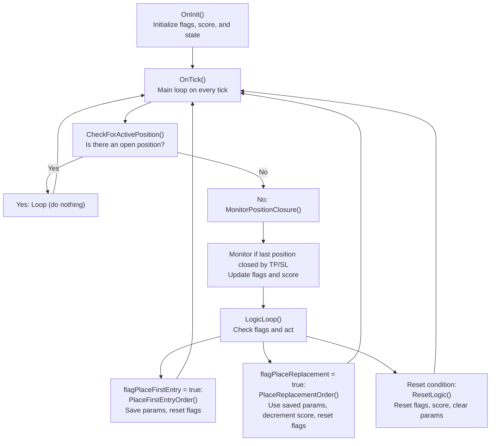

# SimpleOneTradeEA Code Flow Technical Document

## Overview
This document describes the code flow for the `SimpleOneTradeEA.mq5` Expert Advisor, which implements both the state loop and the logic loop as described in the project requirements. The EA uses OOP principles and manages trade entries and replacements using a clear flag and state system.

## Code Flow (Mermaid Diagram)

## Notes
- The EA only places BUY orders for both first entry and replacements.
- All replacement orders use the exact parameters of the first entry until a reset occurs.
- The state loop ensures only one position is managed at a time.
- The logic loop manages the trading logic and flag transitions.
